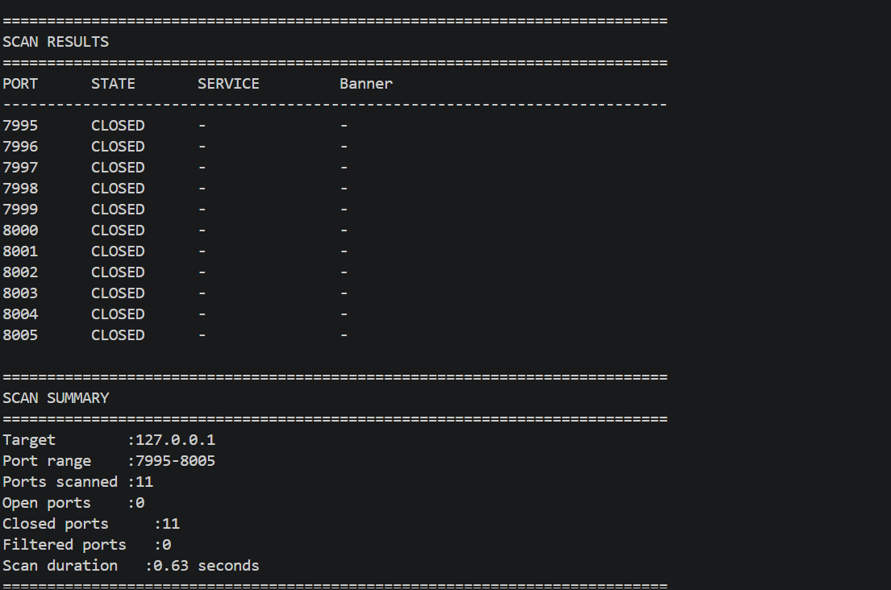
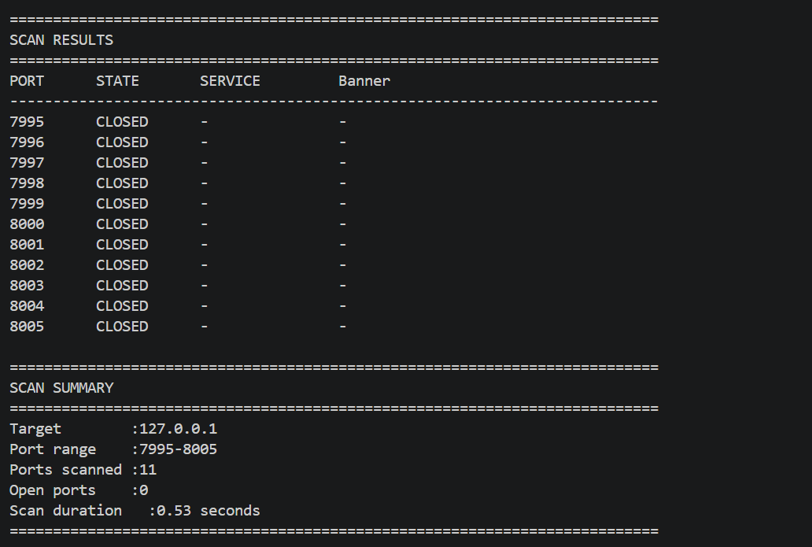
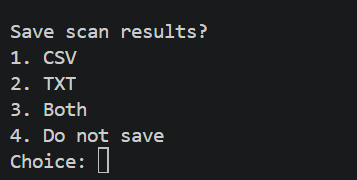

# Python Port Scanner

A multithreaded network port scanner built with Python and Scapy. The tool can scan a target host for open TCP ports, identify common services, perform basic banner grabbing, and export scan results for further analysis.

> **Educational Use Only:** Only scan systems you own or have explicit permission to test.

## Features

- TCP Connect scanning
- TCP SYN scanning using Scapy
- Multithreaded port scanning
- Hostname-to-IP resolution
- Custom port ranges
- Open, closed, and filtered port detection
- Common service identification
- Basic banner grabbing
- HTTP service probing
- Scan duration and statistics
- CSV report export
- TXT report export

## Project Structure

```text
port-scanner/
├── main.py          # Main CLI and program flow
├── scanner.py       # TCP Connect scanner
├── syn_scanner.py   # SYN scanner
├── services.py      # Service detection and banner grabbing
├── exporter.py      # CSV/TXT report generation
├── test_server.py   # Local testing server
├── requirements.txt
├── README.md
└── reports/         # Generated reports
```

## Requirements

- Python 3
- Scapy
- Npcap on Windows for SYN scanning
- Administrator/root privileges may be required for raw packet scanning

## Installation

Clone the repository:

```bash
git clone <your-repository-url>
cd port-scanner
```

Install the Python dependencies:

```bash
pip install -r requirements.txt
```

## Usage

Run the scanner:

```bash
python main.py
```

Enter the target hostname or IP address:

```text
Enter target IP or hostname: 127.0.0.1
```

Choose the port range:

```text
Enter starting port: 1
Enter ending port: 1000
```

Choose a scanning method:

```text
Select scan type:
1. TCP Connect Scan
2. SYN Scan
```

The scanner will display results containing:

```text
PORT      STATE       SERVICE         BANNER
------------------------------------------------------------
80        OPEN        http            HTTP server
```

After the scan, results can optionally be exported as:

- CSV
- TXT
- Both formats

Generated reports are stored in the `reports/` directory.

## TCP Connect Scan

The TCP Connect scan attempts to establish a complete TCP connection with each target port.

If the connection succeeds, the port is considered open.

## SYN Scan

The SYN scanner uses Scapy to send TCP SYN packets without completing the full TCP three-way handshake.

Typical responses are interpreted as:

- `SYN/ACK` → Open
- `RST` → Closed
- No response → Filtered

## Service Detection

For discovered open ports, the scanner attempts to:

1. Identify the standard service associated with the port.
2. Retrieve an available service banner.
3. Perform a basic HTTP probe on common HTTP ports.

This can provide additional information about the service running on an open port.

## Example

```text
============================================================
SCAN INFORMATION
============================================================
Target       : 127.0.0.1
Port range   : 7995-8005
Ports        : 11
Scan type    : TCP Connect Scan

Running TCP Connect Scan...

===========================================================================
SCAN RESULTS
===========================================================================

PORT      STATE       SERVICE         BANNER
---------------------------------------------------------------------------
8000      OPEN        http            SimpleHTTP/0.6 Python/3.x

===========================================================================
SCAN SUMMARY
===========================================================================
Target          : 127.0.0.1
Port range      : 7995-8005
Ports scanned   : 11
Open ports      : 1
Scan duration   : 0.52 seconds
===========================================================================
```

## Testing

A simple local test server is included.

Run:

```bash
python test_server.py
```

Then run the scanner in another terminal:

```bash
python main.py
```

Scan:

```text
Target: 127.0.0.1
Port: 9999
```

You can also start Python's built-in HTTP server:

```bash
python -m http.server 8000
```

Then scan port `8000` to test HTTP service detection.

## Technologies Used

- Python
- Socket Programming
- Scapy
- TCP/IP
- Multithreading
- CSV

## What I Learned

Building this project helped me develop practical knowledge of:

- TCP/IP networking
- TCP connection establishment
- SYN scanning
- Socket programming
- Network service identification
- Banner grabbing
- Multithreading in Python
- Raw packet manipulation with Scapy
- Modular Python project structure
- Exporting and documenting security scan results

## Limitations

This project is intended as an educational port scanner rather than a replacement for professional network scanners.

Service detection is basic, firewall behavior can affect results, and SYN scanning may require elevated privileges and additional packet-capture drivers depending on the operating system.

## 📸 Project Screenshots

### Port Scan Results
Multithreaded port scanning showing detected port states.



### Service Detection
Detected services and banners running on open ports.



### SYN Scan
TCP SYN scanning used to identify open ports.


### Saved Scan Results
Scan results exported and saved for later analysis.


## Disclaimer

This project is intended for educational purposes and authorized security testing only.

Do not use this tool to scan systems, networks, or devices without explicit authorization. The user is responsible for ensuring that all use complies with applicable laws and policies.